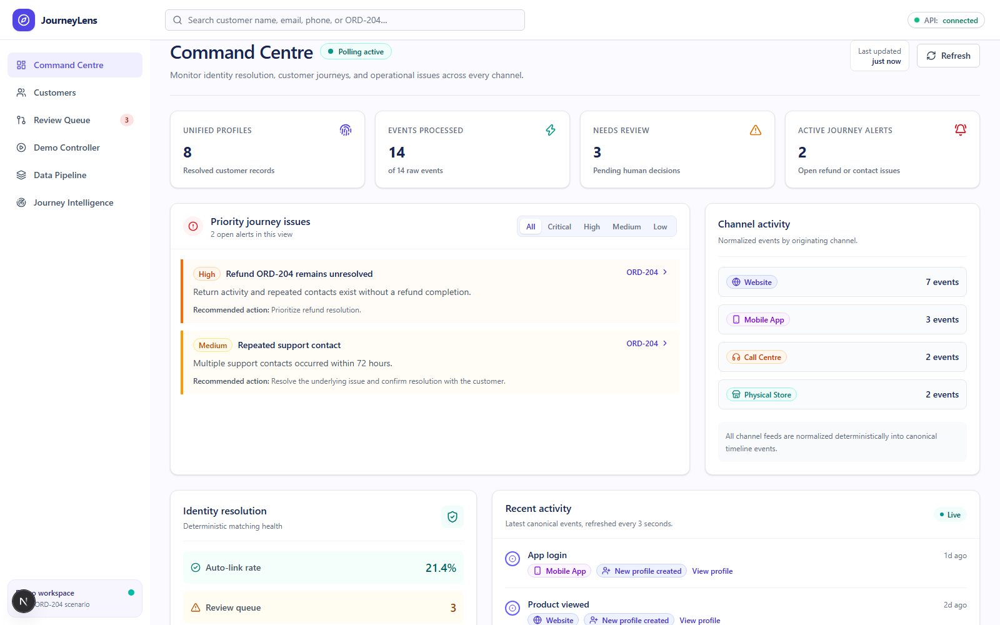
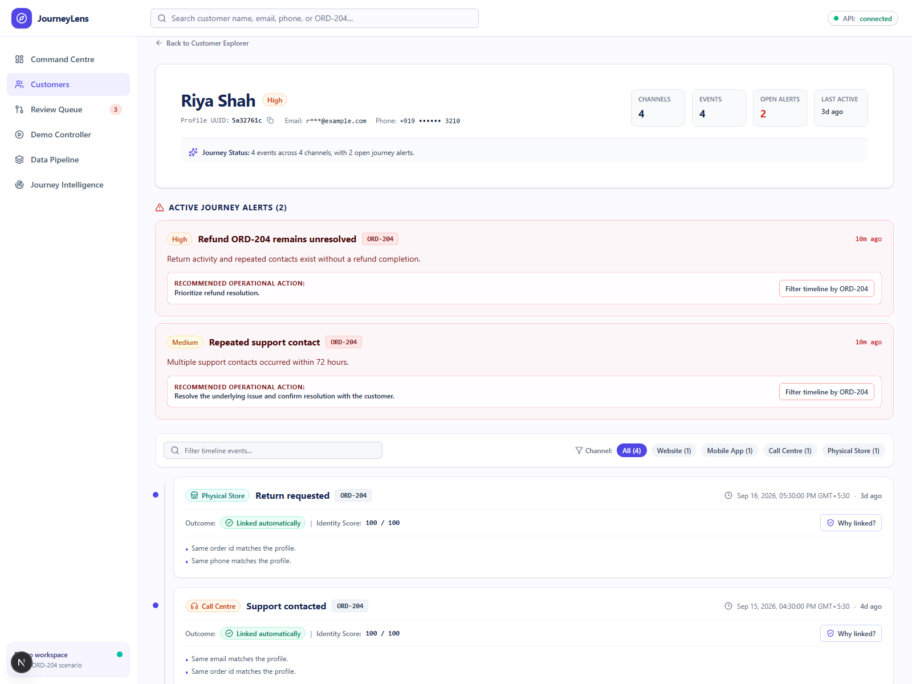
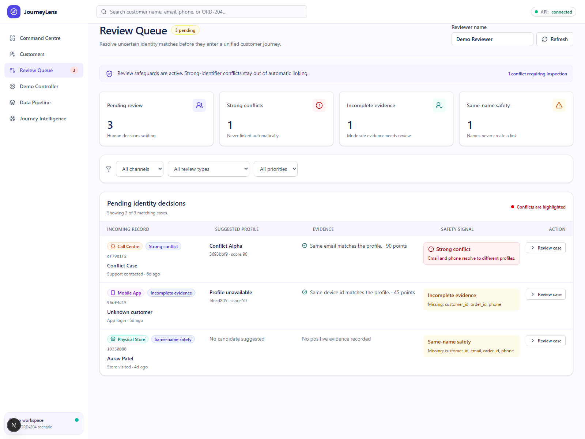
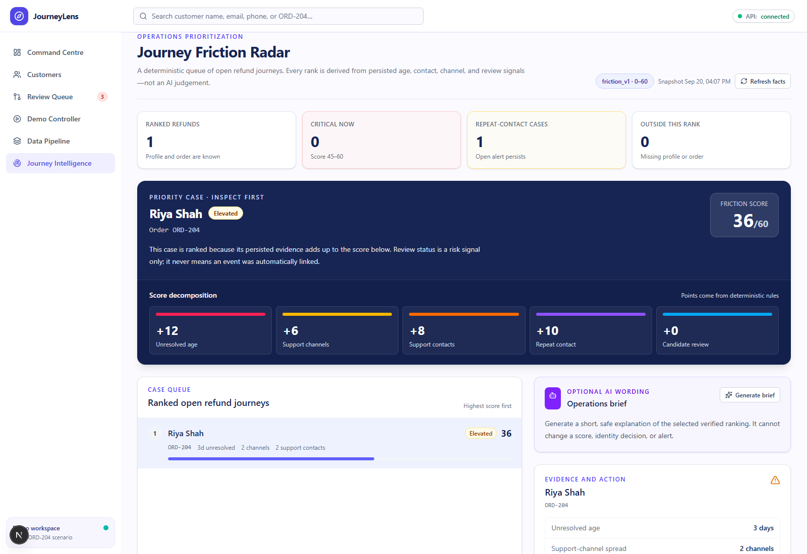
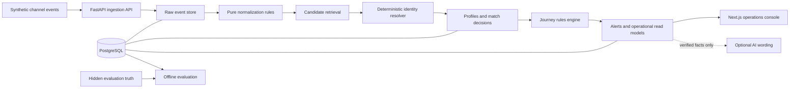

<div align="center">

# JourneyLens

### Explainable identity resolution for broken refund journeys

JourneyLens joins fragmented commerce and support events into one auditable customer timeline, detects unresolved refunds and repeated contact, and sends uncertain identity matches to a human reviewer.

[](https://github.com/PushkarManvar/Bit-N-Build/actions/workflows/ci.yml)


**Deterministic rules · field-level evidence · synthetic data · human review**

</div>



## The problem

A customer can start a return on the website, check the refund in the mobile app, call support, and visit a store. Most teams see four unrelated records. The customer repeats the story while an unresolved refund hides behind channel-level activity.

JourneyLens reconstructs that journey without guessing who the customer is. It preserves the source payload, normalizes each event, evaluates identity evidence with deterministic rules, and records the reason behind each link or non-link.

The flagship scenario follows **Riya Shah** and order **`ORD-204`** across four channels. A second scenario proves the safety boundary: two records named **Aarav Patel** stay separate when no strong identifier supports a merge.

## Product proof

| Step | JourneyLens action | Visible result |
|---:|---|---|
| 1 | Accept a web, app, call-centre, or store event | Raw JSON remains available for audit |
| 2 | Normalize identifiers and event vocabulary | Every channel produces the same canonical shape |
| 3 | Retrieve candidates and score field-level evidence | The decision shows matches, conflicts, weights, and thresholds |
| 4 | Apply conflict and tie rules | Strong conflicts and weak evidence enter review |
| 5 | Build the customer timeline | Riya's four events appear in time order under one profile |
| 6 | Evaluate journey rules | `ORD-204` receives unresolved-refund and repeat-contact alerts |
| 7 | Resolve uncertain cases | A reviewer can approve, reject, or create a separate profile |

## Product tour

### Unified journey with evidence

Riya's profile combines four channels, two open alerts, deterministic identity scores, and a direct **Why linked?** path for each event.



### Human review for unsafe matches

The queue separates strong conflicts, incomplete evidence, and same-name safety cases. A name match cannot create an automatic link.



### Deterministic journey prioritization

The Friction Radar presents every priority case on the same light operations surface used across JourneyLens. Colored signal bars separate unresolved age, support-channel spread, contact count, repeat contact, and candidate review, while persisted facts determine every point. Optional AI wording can summarize verified facts; it cannot alter a score, identity decision, or alert.



## Core capabilities

- **Multi-channel ingestion:** web, mobile app, call centre, and physical store events share one validated envelope.
- **Raw evidence retention:** the original source payload survives normalization and downstream processing.
- **Explainable identity resolution:** every decision stores candidates, evidence, conflicts, score, thresholds, and outcome.
- **False-merge protection:** a strong identifier conflict blocks automatic linking, regardless of score.
- **Name-only safety:** similar names can suggest review candidates but can never auto-link profiles.
- **Unified customer timeline:** linked events appear in order with channel, outcome, score, and evidence access.
- **Broken-journey detection:** deterministic rules detect unresolved refunds and repeat contact without an LLM.
- **Review workflow:** reviewers can approve a link, reject it, or create a new profile with an audit record.
- **Operational read models:** the Command Centre, Data Pipeline, Customer Explorer, Review Queue, and Friction Radar use persisted data.
- **Controlled demo:** a resettable six-step scenario reproduces the Riya and Aarav stories without external services.
- **Evaluation tooling:** hidden truth files support precision, recall, F1, false-merge, and alert checks without entering runtime matching.

## Architecture

JourneyLens uses a modular monolith. The synchronous path keeps each decision traceable from HTTP request to database record and UI explanation.



### Identity decision policy

| Evidence | Weight | Decision role |
|---|---:|---|
| Customer ID | 100 | Strong |
| Order ID | 95 | Strong |
| Verified email | 90 | Strong |
| Normalized phone | 85 | Strong |
| Device ID | 45 | Moderate |
| Session ID | 35 | Moderate |
| Name similarity | 15–20 | Weak, never sufficient for auto-link |
| Same city | 5 | Weak |

The resolver caps scores at 100. A score of 80 or more may auto-link only when strong evidence agrees and no strong conflict exists. Scores from 50 to 79 require review. Near ties also require review. A strong conflict overrides the numeric score.

## Technology

| Layer | Choice | Purpose |
|---|---|---|
| Frontend | Next.js 16, React 19, TypeScript, Tailwind CSS | Operations console and evidence workflows |
| Backend | FastAPI, Pydantic, SQLAlchemy | Typed API and deterministic business services |
| Database | PostgreSQL 17, Alembic | Raw events, profiles, decisions, alerts, and audit records |
| Testing | pytest, Vitest, Testing Library | Rule, API, integration, and component coverage |
| Quality | Ruff, ESLint, TypeScript strict mode | Static checks and formatting guardrails |
| Runtime | Docker Compose | Reproducible frontend, backend, and database stack |
| CI | GitHub Actions | Backend, frontend, and Docker validation |

## Quick start

### Prerequisites

- Git
- Docker Desktop, or Docker Engine with Docker Compose v2

### Start the full stack

```bash
git clone https://github.com/PushkarManvar/Bit-N-Build.git
cd Bit-N-Build
cp .env.example .env
docker compose up --build -d
docker compose ps
```

PowerShell users can replace the copy command with:

```powershell
Copy-Item .env.example .env
```

Open these local services:

| Service | Address |
|---|---|
| JourneyLens | <http://localhost:3000> |
| Backend health | <http://localhost:8000/health> |
| OpenAPI documentation | <http://localhost:8000/docs> |
| PostgreSQL | `localhost:5432` |

Stop the stack without deleting local data:

```bash
docker compose down
```

## Run the two-minute demo

1. Open <http://localhost:3000/demo>.
2. Select **Reset demo**, then confirm the reset. This loads the curated review cases.
3. Select **Run scenario**. JourneyLens ingests the six flagship events in a fixed order.
4. Open the `ORD-204` alert from the Command Centre.
5. Inspect **Why linked?** on Riya's timeline, then open the Review Queue to see the Aarav safety case.

The scenario runs on local synthetic data and does not need an LLM or external integration.

## Development workflow

The Make targets provide the shortest path on macOS, Linux, and WSL:

```bash
make doctor      # Check Git, Docker, and Compose
make setup       # Create .env and build images
make up          # Start the stack
make logs        # Follow frontend, backend, and database logs
make test        # Run backend tests plus frontend type and lint checks
make lint        # Run Ruff, ESLint, and TypeScript checks
make down        # Stop services and keep data
```

### Full local verification

These commands mirror the CI checks:

```bash
docker compose run --rm backend ruff check app tests
docker compose run --rm backend pytest -q
docker compose run --rm frontend npm run lint
docker compose run --rm frontend npm run typecheck
docker compose run --rm frontend npm run test
docker compose run --rm frontend npm run build
docker compose config
```

## API surface

Product endpoints use the `/api` prefix; health probes stay at the root. FastAPI exposes the complete schema at <http://localhost:8000/docs>.

| Area | Endpoints |
|---|---|
| Health | `GET /health`, `GET /ready` |
| Events | `POST /api/events`, `GET /api/events/{raw_event_id}`, match explanations |
| Profiles | `GET /api/profiles`, `GET /api/profiles/{profile_id}` |
| Alerts | `GET /api/alerts` |
| Reviews | `GET /api/reviews`, `GET /api/review-queue`, `POST /api/reviews/{id}/resolve` |
| Analytics | overview, channels, friction radar, optional operations brief |
| Pipeline | overview, filtered events, event inspector, cursor-based updates |
| Demo | reset, start, status, and dashboard polling endpoints |

The shared error envelope includes a stable code, human-readable message, processing stage, related raw event ID, and structured details.

## Repository map

```text
.
├── backend/
│   ├── app/api/          # HTTP routes and response mapping
│   ├── app/services/     # Normalization, matching, alerts, reviews, analytics
│   ├── app/db/           # SQLAlchemy session and models
│   ├── alembic/          # Append-only schema migrations
│   ├── scripts/          # Data generation, loading, validation, evaluation
│   └── tests/            # Unit, API, service, and integration tests
├── frontend/
│   ├── app/              # Next.js routes
│   ├── components/       # Product views and reusable UI
│   └── lib/              # Central API client, types, formatters, presenters
├── data/
│   ├── raw/              # Visible synthetic channel events
│   ├── demo/             # Deterministic demo scenarios
│   ├── fixtures/         # Focused rule fixtures
│   └── expected/         # Visible contract expectations
├── docs/                 # Product, UX, architecture, rules, API, and runbooks
├── compose.yaml          # Local three-service stack
└── Makefile              # Development shortcuts
```

Hidden truth data under `data/truth/` stays out of runtime code and version control. Evaluation scripts may read it after matching completes.

## Environment configuration

The checked-in `.env.example` contains development defaults only.

| Variable | Used by | Purpose |
|---|---|---|
| `DATABASE_URL` | Backend | SQLAlchemy PostgreSQL connection |
| `CORS_ORIGINS` | Backend | Allowed browser origins |
| `NEXT_PUBLIC_API_URL` | Frontend | Browser-facing API base URL |
| `POSTGRES_DB` | Database | Local database name |
| `POSTGRES_USER` | Database | Local database user |
| `POSTGRES_PASSWORD` | Database | Local-only database password |
| `LLM_PRIMARY_*`, `LLM_BACKUP_*` | Optional brief adapter | Facts-only wording provider configuration |

Do not commit `.env`, credentials, real customer data, generated truth files, or local database volumes.

## Documentation

| Document | Covers |
|---|---|
| [Start here](docs/00_START_HERE.md) | Build gates and golden path |
| [Product requirements](docs/01_PRODUCT_REQUIREMENTS.md) | Scope, users, requirements, metrics |
| [User workflows and UX](docs/02_USER_WORKFLOWS_AND_UX.md) | Screens, states, and review behavior |
| [Technical architecture](docs/03_TECHNICAL_ARCHITECTURE.md) | Components, data flow, errors, deployment boundary |
| [Identity and journey rules](docs/04_DATA_IDENTITY_AND_RULES.md) | Normalization, scoring, conflicts, alerts |
| [API contract](docs/05_API_CONTRACT.md) | Request, response, and error shapes |
| [Implementation plan](docs/06_IMPLEMENTATION_AND_TEAM_PLAN.md) | Delivery slices and ownership |
| [Testing and demo runbook](docs/07_TESTING_EVALUATION_AND_DEMO.md) | Critical cases, evaluation, presentation route |
| [Local development](docs/08_LOCAL_DEVELOPMENT.md) | Docker and native setup |
| [Documentation index](docs/README.md) | Complete project documentation |

## Safety boundary

JourneyLens is a hackathon prototype that uses labelled synthetic data. It does not execute refunds, contact customers, replace a CRM, or make autonomous identity decisions with an LLM.

Production use would require privacy and consent controls, authentication and roles, calibrated thresholds on representative data, profile split and unmerge operations, monitoring, governance, and source-system integration testing.

## Contributing

Read [CONTRIBUTING.md](CONTRIBUTING.md) before opening a change and [SECURITY.md](SECURITY.md) before handling data or identity rules. Keep commits focused, add tests for rule changes, and preserve these invariants:

- Similar names never auto-link profiles.
- Strong identifier conflicts always require review.
- Raw source evidence remains available.
- Runtime matching never reads hidden truth files.
- Optional AI wording never decides identity, alert truth, or operational priority.

---

<div align="center">

Built to show the complete refund story and the evidence behind every identity decision.

</div>
