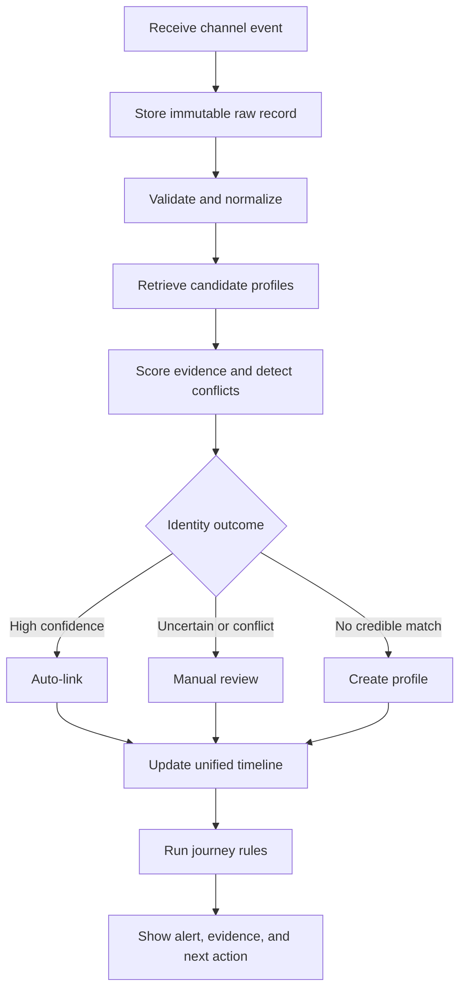

# JourneyLens — Product Definition and MVP Specification

**Version:** 1.0  
**Status:** Build baseline  
**Project type:** 30-hour, three-person hackathon build  
**Domain:** E-commerce returns and refunds

---

## 1. Final product decision

We will build **JourneyLens**, an explainable customer-journey resolution product for e-commerce refund and return support.

JourneyLens will ingest fragmented events from the website, mobile app, call centre, and physical store; normalize inconsistent identity information; link events to a customer profile using conservative, deterministic evidence; build a unified journey timeline; and flag unresolved refund journeys and repeated customer contact.

The product is **not** a CRM, generic analytics dashboard, or support chatbot.

### One-line pitch

> JourneyLens explains how apparently separate interactions belong to one customer—and exposes the broken refund journey that made them contact support repeatedly.

### Core product promise

> Help a support agent understand the complete, evidence-backed customer story in one view without risking unsafe customer merges.

### Primary success moment

For order `ORD-204`, JourneyLens connects four events belonging to Riya Shah across web, mobile app, call centre, and store; explains every link; and flags an unresolved refund with repeated contact. It also keeps two customers named Aarav Patel separate when no strong shared identity evidence exists.

---

## 2. Problem and desired outcome

### Problem

Customer interactions are stored as separate records across channels. Inconsistent or missing email addresses, phone numbers, device IDs, order IDs, and names make one customer look like several unrelated people.

This causes:

- repeated manual searches across systems;
- customers having to explain the same issue repeatedly;
- missed repeat-contact and unresolved-refund signals;
- unsafe merges between different customers with similar names; and
- poor visibility into which journeys need urgent action.

### Desired outcome

A support agent can move from an incoming interaction or alert to one trustworthy customer journey, understand why the records were linked, see any uncertainty, and identify the next operational action.

### Users

| User | Primary job |
|---|---|
| Support agent | Understand a customer's full refund history and take the correct next action |
| Support operations manager | Find and prioritize broken refund journeys and repeated-contact cases |
| Data-quality reviewer | Approve or reject uncertain identity matches |

---

## 3. Product principles

1. **Explain every identity decision.** Show the matched fields, score, conflicts, alternatives, and final outcome.
2. **Prefer safety over aggressive matching.** Name similarity alone can never trigger an automatic merge.
3. **Preserve the source record.** Raw payloads remain immutable and inspectable.
4. **Use deterministic logic for core decisions.** Identity matching and journey alerts must be measurable and reproducible.
5. **Keep humans in control of ambiguity.** Strong conflicts and medium-confidence cases go to review.
6. **Turn data into action.** Every broken-journey alert must explain the problem and the recommended next step.
7. **Optimize for one reliable vertical slice.** The `ORD-204` journey is more important than extra charts or integrations.

---

## 4. Scope boundary

### We will build

- Four synthetic event sources: web, mobile app, call centre, and physical store.
- Raw event ingestion with duplicate protection and failure tracking.
- A canonical normalized event format.
- Exact matching on customer ID, order ID, email, and normalized phone.
- Device/session evidence for anonymous-to-known linkage.
- Conservative confidence scoring and strong-identifier conflict detection.
- Three outcomes: auto-link, manual review, or new profile.
- An inspectable match-decision record with evidence.
- A unified chronological customer journey.
- Unresolved-refund and repeat-contact alerts.
- A correct same-name non-merge scenario.
- A manual-review queue with merge/keep-separate decisions.
- Evaluation against hidden synthetic ground truth.
- Four focused frontend pages.

### We may build after the core is stable

- Controlled live event playback.
- Channel-switching alerts.
- Checkout drop-off alerts.
- Template-based or LLM-generated journey summaries.
- CSV import.
- Additional charts and priority ranking.
- Deployment and dark mode.

### We will not build

- A full CRM or ticketing platform.
- Real payment or refund execution.
- Production authentication, permissions, or multi-tenancy.
- Real customer data or enterprise integrations.
- Autonomous refund approval or customer messaging.
- LLM-driven identity matching.
- Complex predictive ML without real labelled data.
- Kafka, Spark, Airflow, blockchain, or enterprise-scale infrastructure.

---

## 5. End-to-end system workflow

### Processing rules

1. Save the incoming payload before attempting normalization.
2. Normalize source-specific fields into the canonical schema.
3. Retrieve candidates using exact identifiers first.
4. Score evidence with a capped, explainable policy.
5. Block automatic linking when strong identifiers conflict.
6. Persist the decision and its evidence.
7. Update the customer timeline only after the identity outcome is known.
8. Run journey rules and avoid duplicate open alerts.

---

## 6. Primary user workflows

### Workflow A — Investigate and act on a broken journey

**Actor:** Support agent or operations manager  
**Trigger:** A high-severity unresolved-refund alert appears.

1. Open the Command Centre.
2. Select the unresolved-refund alert for `ORD-204`.
3. Review Riya Shah's unified four-channel timeline.
4. Open a timeline event to inspect the raw payload, normalized fields, match score, evidence, and conflicts.
5. Confirm that the refund is still unresolved and multiple contacts occurred.
6. Prioritize the case for refund resolution.

**Successful outcome:** The user understands the complete case from one view and knows why it requires action.

### Workflow B — Review an uncertain identity match

**Actor:** Data-quality reviewer  
**Trigger:** An event receives a score from 50–79 or contains a strong-identifier conflict.

1. Open the Review Queue.
2. Compare the incoming event with the suggested profile.
3. Review matching evidence, missing identifiers, and conflicts.
4. Choose `Approve match`, `Reject match`, or `Create new profile`.
5. Add an optional reviewer note.
6. The system records the decision and updates the timeline when appropriate.

**Successful outcome:** Ambiguous records are resolved without hiding uncertainty or causing an unsafe merge.

### Workflow C — Demonstrate anonymous-to-known linking

**Actor:** Demo presenter  
**Trigger:** The presenter starts the Riya/`ORD-204` scenario.

1. A web `return_started` event arrives with device `DEV-17`.
2. A mobile event arrives with the same device, email, and order.
3. JourneyLens links the earlier anonymous event to Riya and displays the evidence.
4. Call-centre and store events arrive with the normalized phone and `ORD-204`.
5. The timeline expands to four channels.
6. The system flags the unresolved refund and repeat contact.
7. A same-name Aarav Patel record is routed to review and kept separate.

**Successful outcome:** The audience sees both a correct merge and a correct non-merge in under two minutes.

---

## 7. MVP features and priority

| Priority | Feature | Why it matters | Done when |
|---|---|---|---|
| P0 | Raw event ingestion | Creates the audit trail | Valid and invalid source payloads are stored with status |
| P0 | Normalization | Makes cross-channel comparison possible | All four source formats produce the same canonical model |
| P0 | Candidate retrieval and matching | Solves the root cause | Every event produces auto-link, review, or new-profile outcome |
| P0 | Conflict protection | Prevents harmful false merges | Conflicting strong identifiers always block auto-link |
| P0 | Match explanation | Creates trust and differentiation | UI shows score, evidence, conflicts, candidate, and decision |
| P0 | Unified journey timeline | Gives agents the full story | Riya's four-channel events appear chronologically in one profile |
| P0 | Unresolved-refund alert | Converts identity resolution into action | `ORD-204` produces the expected high-severity alert |
| P0 | Repeat-contact alert | Reveals customer effort | Two relevant contacts within 72 hours produce an alert |
| P0 | Same-name non-merge | Proves safety | The two Aarav Patel profiles remain separate |
| P0 | Ground-truth evaluation | Makes claims measurable | Precision, recall, F1, and false-merge rate are computed |
| P1 | Manual-review UI | Completes the human-control loop | Reviewer can approve, reject, or create a new profile |
| P1 | Command Centre | Makes the demo navigable | KPIs, open alerts, and recent processing are visible |
| P1 | Customer Explorer | Supports case discovery | Users can search and filter profiles and open a journey |
| P1 | Controlled demo playback | Produces a repeatable live story | The `ORD-204` events play in a fixed order without internet dependence |
| P2 | Channel-switching alert | Adds operational insight | Three channels within 48 hours create an alert |
| P2 | AI journey summary | Improves readability only | Summary uses already-resolved facts and has a deterministic fallback |

### Build order under time pressure

1. Ingestion and normalization.
2. Exact matching and conflict protection.
3. Match-decision evidence.
4. Riya timeline.
5. Unresolved-refund and repeat-contact alerts.
6. Same-name correct non-merge.
7. Evaluation metrics.
8. Manual-review UI.
9. Demo playback.
10. Optional summaries and extra analytics.

---

## 8. Functional requirements and acceptance criteria

| ID | Requirement | Acceptance criteria |
|---|---|---|
| FR-01 | Ingest one source event | `POST /api/events` stores the original payload and returns its processing result |
| FR-02 | Handle duplicates safely | Re-sending the same source record does not create a second canonical event |
| FR-03 | Preserve normalization failures | Invalid downstream data remains in `raw_events` with a visible failed status |
| FR-04 | Normalize identity fields | Email, phone, order ID, name, timestamps, and event names follow documented rules |
| FR-05 | Retrieve possible profiles | Exact strong identifiers and device/session identifiers produce candidate profiles |
| FR-06 | Decide identity outcome | Score ≥80 auto-links; 50–79 reviews; <50 creates a new profile; conflict always reviews |
| FR-07 | Explain the match | Every processed event stores the considered candidates, score, evidence, conflicts, and decision |
| FR-08 | Build a profile timeline | Linked canonical events display in chronological order with source channel |
| FR-09 | Detect unresolved refunds | A return plus at least two contacts and no refund completion creates one open alert |
| FR-10 | Detect repeat contact | At least two refund-related contacts within 72 hours create one alert |
| FR-11 | Resolve manual reviews | A reviewer can approve, reject, or create a separate profile, with an audit record |
| FR-12 | Evaluate the resolver | Hidden ground truth produces precision, recall, F1, and false-merge rate |
| FR-13 | Run the flagship demo | The fixed Riya and Aarav scenarios complete without external services |

---

## 9. Identity-resolution policy

### Evidence weights

| Evidence | Score | Rule |
|---|---:|---|
| Same customer ID | 100 | Decisive strong match |
| Same order ID | 95 | Strong domain-specific match |
| Same verified email | 90 | Strong match |
| Same normalized phone | 85 | Strong match |
| Same device ID | 45 | Anonymous-to-known bridge |
| Same session ID | 35 | Supporting, short-lived evidence |
| Name similarity ≥92 | 15–20 | Supporting evidence only |
| Same city | 5–10 | Supporting evidence only |
| Strong-identifier conflict | Block | Always route to manual review |

### Decision thresholds

| Condition | Outcome |
|---|---|
| Score ≥80 and no strong conflict | Auto-link |
| Score 50–79 | Manual review |
| Score <50 | Create new profile |
| Strong identifiers map to different profiles | Manual review regardless of score |

Scores are capped and evidence is not added blindly. Name similarity alone never creates an automatic link.

---

## 10. Journey rules in the MVP

### Unresolved refund

Create a high-severity alert when the same profile and order have:

- a return-started, return-requested, or return-received event;
- no `refund_completed` event; and
- at least two support-related contacts.

### Repeat contact

Create a medium-severity alert when a profile/order has at least two `support_call`, `support_ticket_created`, or `refund_status_checked` events within 72 hours.

### Duplicate-alert protection

Only one open alert may exist for the same `(profile_id, order_id, alert_type)` combination.

---

## 11. Screens

### 1. Command Centre — `/`

- Events processed
- Unified profiles
- Open broken journeys
- Pending reviews
- Matching metrics
- Recent ingestion activity
- `Run refund journey demo` action

### 2. Customer Explorer — `/customers`

- Searchable profile table
- Channels, event count, open issue, and last-seen time
- Visible separation of same-name profiles

### 3. Journey Detail — `/customers/[profileId]`

- Customer identity summary
- Prominent active alert
- Unified chronological timeline
- Raw event and normalized event view
- Match-explanation drawer
- Recommended operational next action

### 4. Review Queue — `/reviews`

- Incoming event and best candidate
- Evidence, missing data, and conflict warnings
- `Approve match`, `Reject match`, and `Create new profile` actions
- Review audit note

---

## 12. Technical baseline

| Layer | Decision |
|---|---|
| Frontend | Next.js, React, TypeScript, Tailwind CSS |
| Charts | Recharts only where a chart improves comprehension |
| Backend | FastAPI and Python |
| Validation | Pydantic |
| Database | Supabase-hosted PostgreSQL |
| Data access | SQLAlchemy |
| Identity matching | Deterministic Python rules with RapidFuzz for supporting name similarity |
| Synthetic data | Faker |
| Evaluation | Pandas and scikit-learn metrics |
| Live updates | Polling every 2–3 seconds for the baseline; SSE only if time remains |
| AI | Optional post-processing summary; never used for identity or alert decisions |
| Local reliability | Seeded data and controlled playback must work without external API calls |

### Core data entities

| Entity | Purpose |
|---|---|
| `raw_events` | Immutable source payload and processing status |
| `canonical_events` | Normalized event and resolved profile reference |
| `customer_profiles` | Unified customer entity |
| `profile_identifiers` | Emails, phones, devices, orders, sessions, and customer IDs linked to profiles |
| `match_decisions` | Candidate scores, evidence, conflicts, decision, and review state |
| `journey_alerts` | Actionable unresolved-refund and repeat-contact alerts |
| `manual_review_actions` | Optional but recommended review audit history |

### Baseline API surface

| Method | Endpoint | Purpose |
|---|---|---|
| POST | `/api/events` | Ingest and process one event |
| POST | `/api/events/bulk` | Load the synthetic dataset |
| GET | `/api/profiles` | Search and filter customer profiles |
| GET | `/api/profiles/{profile_id}` | Return profile, timeline, alerts, and summary |
| GET | `/api/events/{event_id}/match-explanation` | Return identity evidence and decision details |
| GET | `/api/reviews?status=pending` | Return manual-review cases |
| POST | `/api/reviews/{decision_id}/resolve` | Save a human identity decision |
| GET | `/api/analytics/overview` | Return dashboard and evaluation metrics |
| POST | `/api/demo/start` | Start controlled scenario playback |
| GET | `/api/dashboard/updates` | Poll for processed events and new alerts |

FastAPI's generated OpenAPI documentation at `/docs` is part of the engineering deliverable.

---

## 13. Synthetic dataset specification

| Component | Target |
|---|---:|
| Ground-truth customers | 30–40 |
| Total source events | 180–250 |
| Channels | 4 |
| Invalid records | 3–5 |
| Duplicate events | 3–8 |
| Manual-review candidates | 5–10 |
| Broken journeys | 5 |
| Same-name collision cases | 2–3 |
| Anonymous-to-known transitions | 5–8 |

Visible source data and hidden evaluation truth must be stored separately. The flagship data must include Riya Shah/`ORD-204`, `DEV-17`, and two distinct Aarav Patel customers.

---

## 14. Quality and non-functional requirements

- **Safety:** False merges are treated as the most serious matching error.
- **Explainability:** Every automated identity decision is traceable to explicit evidence.
- **Auditability:** Raw events and match decisions are never silently overwritten.
- **Reliability:** The complete demo works with seeded local data and no LLM dependency.
- **Performance:** Individual synthetic events should normally process in under one second locally.
- **Idempotency:** Duplicate source records do not create duplicate downstream data.
- **Usability:** A judge can understand the correct merge, alert, and non-merge in under two minutes.
- **Privacy:** Only synthetic data is used.
- **Testability:** Normalization, matching, conflicts, and alert rules have automated tests.

---

## 15. Team workflow and ownership

| Owner | Primary responsibility | Main deliverables |
|---|---|---|
| Member 1 | Frontend and demo experience | Four pages, timeline, explanation drawer, review interactions, controlled demo UI |
| Member 2 | Backend, API, and database | Schema, ingestion, normalization, profiles, reviews, analytics, polling endpoint |
| Member 3 | Dataset, matching, and analytics | Generator, truth data, resolver, conflicts, journey rules, evaluation, tests |

### Integration rules

- Freeze canonical event fields and API response shapes before parallel implementation.
- Use one shared sample payload for each channel.
- Keep the `ORD-204` scenario as an automated integration test.
- Merge only code that preserves the golden path.
- Remove unfinished navigation items instead of exposing incomplete screens.

---

## 16. 30-hour implementation plan

| Hours | Focus | Exit condition |
|---:|---|---|
| 0–2 | Scope, repository, schema, contracts | App runs; schema and canonical event/API shapes are frozen |
| 2–6 | Data generator and ingestion | Four source formats enter `raw_events`; duplicates and failures are visible |
| 6–10 | Normalization and identity resolution | Every event resolves to link, review, or new profile with evidence |
| 10–14 | Journey rules and APIs | `ORD-204` produces the expected timeline and alerts |
| 14–20 | Frontend golden path | Alert → profile → timeline → explanation is navigable |
| 20–24 | Review queue and demo playback | Aarav is kept separate; fixed playback works |
| 24–27 | Evaluation, tests, and polish | Metrics are computed; error/loading/empty states work |
| 27–30 | Rehearsal and fallback | Two-minute story, backup recording, and screenshots are ready |

### Pivot checkpoint

At build hour 8–10, switch to **Refund Friction Radar** if identity resolution cannot reliably demonstrate both a correct merge and a correct non-merge. The backup retains known customer/order identity and focuses on the timeline plus broken-journey alerts.

---

## 17. Definition of done

The MVP is done only when all of the following are true:

- [ ] Four channel payloads are ingested and normalized.
- [ ] Raw inputs remain inspectable.
- [ ] Riya's anonymous web event is linked through `DEV-17` and later strong identifiers.
- [ ] Riya's call-centre and store events link to the same `ORD-204` journey.
- [ ] Every link shows evidence and a score.
- [ ] The unresolved-refund and repeat-contact alerts appear.
- [ ] The two Aarav Patel customers are not auto-merged.
- [ ] One uncertain record can be resolved in the Review Queue.
- [ ] Precision, recall, F1, and false-merge rate come from hidden truth data.
- [ ] The demo runs from seeded data without internet or LLM dependency.
- [ ] The complete judge story fits within two minutes.

---

## 18. Immediate next actions

1. Create the repository and agreed folder structure.
2. Freeze the canonical event model and the five core API response shapes.
3. Create the PostgreSQL schema and migrations.
4. Generate the four source fixtures plus hidden truth data.
5. Build `POST /api/events` through normalization first.
6. Run a matching spike using Riya and both Aarav records.
7. Build the Journey Detail page against mocked API responses in parallel.
8. Review the pivot checkpoint at hour 8–10.

---

## 19. Decisions now locked

- Product: JourneyLens.
- Domain: e-commerce refunds and returns.
- Primary mechanism: explainable deterministic identity resolution.
- Outcome layer: unified timeline plus broken-journey alerts.
- Human-control layer: manual review for ambiguity or conflict.
- Flagship scenario: Riya Shah and `ORD-204`.
- Safety scenario: two separate customers named Aarav Patel.
- Core channels: web, mobile app, call centre, and physical store.
- Database: Supabase PostgreSQL.
- Live-update baseline: polling; SSE is optional.
- AI: optional summary only, never a core dependency.
- Demo boundary: synthetic data, no enterprise integration, no real refund execution.

This document is the baseline for design, engineering, testing, and the demo. Any new feature must first preserve the P0 golden path and the two-minute story.
