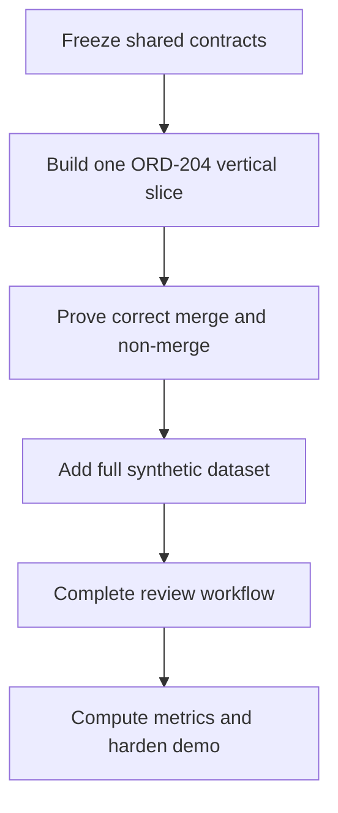

# JourneyLens Documentation Hub

**Purpose:** Give the team one clear starting point and a controlled route from idea to working demo.  
**Baseline:** `JourneyLens_Product_Definition_and_MVP_Spec_v1.md`  
**Status:** Ready to start implementation

## 1. What we are building

JourneyLens is an explainable customer-identity and journey-resolution system for e-commerce returns and refunds.

It turns fragmented events from web, mobile app, call centre, and physical store into:

1. a normalized event record;
2. an explainable identity decision;
3. a unified customer timeline;
4. a broken-journey alert; and
5. a human decision when the evidence is uncertain.

The product's strongest proof is not a dashboard. It is the ability to show why four records belong to Riya Shah while refusing to merge another customer merely because both people are named Aarav Patel.

## 2. Read the documents in this order

| Order | Document | Use it to answer |
|---:|---|---|
| 1 | `00_START_HERE.md` | What do we do first? |
| 2 | `01_PRODUCT_REQUIREMENTS.md` | What problem and requirements are we committing to? |
| 3 | `02_USER_WORKFLOWS_AND_UX.md` | How does each user move through the product? |
| 4 | `03_TECHNICAL_ARCHITECTURE.md` | How do the components and data flow fit together? |
| 5 | `04_DATA_IDENTITY_AND_RULES.md` | How do normalization, matching, conflicts, and alerts work? |
| 6 | `05_API_CONTRACT.md` | What exact contract connects frontend, backend, and data work? |
| 7 | `06_IMPLEMENTATION_AND_TEAM_PLAN.md` | Who does what, in what order, and with what handoffs? |
| 8 | `07_TESTING_EVALUATION_AND_DEMO.md` | How do we test, measure, rehearse, and present the result? |

## 3. The direction in one diagram

The team should not begin with a complete dashboard or hundreds of generated events. First make one event travel through the entire system and appear correctly in the UI. Then add complexity.

## 4. First six hours

### Hour 0–1: Freeze the shared language

Agree on these exact values:

- channels: `web`, `mobile_app`, `call_centre`, `physical_store`;
- identity outcomes: `auto_linked`, `manual_review`, `new_profile`, `rejected`;
- processing states: `received`, `normalized`, `matched`, `failed`, `duplicate`;
- primary event types: `return_started`, `return_requested`, `refund_status_checked`, `support_call`, `refund_completed`;
- flagship profile: Riya Shah;
- flagship order: `ORD-204`;
- anonymous bridge: `DEV-17`.

Exit condition: all three members use the same field names and enums.

### Hour 1–2: Freeze contracts and repository

- Create the repository structure from the implementation plan.
- Add `.env.example` without credentials.
- Add shared sample request and response JSON.
- Create database migrations.
- Confirm that the frontend can use mocked responses matching the API contract.

Exit condition: frontend, backend, and matching work can proceed independently.

### Hour 2–4: Build the thinnest vertical slice

- Ingest one web event.
- Store its raw payload.
- Normalize it.
- Create a new profile or anonymous journey container.
- Return one structured response.
- Render the resulting event on a minimal Journey Detail page.

Exit condition: one click or request creates a visible timeline event.

### Hour 4–6: Prove the identity mechanism

- Ingest the mobile event containing Riya's email, `DEV-17`, and `ORD-204`.
- Link it to the earlier web event using visible evidence.
- Persist the decision.
- Open an explanation panel in the UI.
- Add one Aarav record that must not merge.

Exit condition: the system demonstrates one correct link and one safe non-link.

## 5. Build gates

Do not move to the next gate until the current gate is demonstrable.

| Gate | Proof required |
|---|---|
| G1 — Ingestion | Raw and canonical records exist for one event |
| G2 — Identity | Riya links correctly; Aarav does not merge incorrectly |
| G3 — Journey | Four Riya events appear in chronological order |
| G4 — Insight | `ORD-204` receives unresolved-refund and repeat-contact alerts |
| G5 — Human control | A review case can be kept separate or merged |
| G6 — Evidence | Metrics are computed from hidden truth data |
| G7 — Demo | Full story completes in under two minutes without internet dependency |

## 6. Rules that prevent scope drift

- No new feature enters P0 unless it is required for G1–G7.
- No dashboard chart is built before the Journey Detail page works.
- No LLM integration is attempted before matching and alert rules pass tests.
- No real external integration is needed for the hackathon.
- No identity decision may depend on name similarity alone.
- No live-stream feature may threaten the deterministic playback fallback.
- No member should change shared response shapes without informing the other two members.

## 7. Daily team rhythm

For a compressed hackathon, run a short checkpoint every two hours:

1. Show working output, not a verbal status.
2. State the next dependency or blocker.
3. Confirm whether the golden path still works.
4. Remove or defer anything that threatens the next gate.
5. Record contract or scope changes in the decision log section of the implementation plan.

## 8. Immediate command decisions

| Decision | Chosen direction |
|---|---|
| Database | Supabase PostgreSQL |
| Backend | FastAPI, Pydantic, SQLAlchemy |
| Frontend | Next.js, TypeScript, Tailwind |
| Matching | Deterministic scoring; RapidFuzz only for weak name evidence |
| Live update | Polling first; SSE only as a stretch |
| AI | Optional summary after facts are computed |
| Deployment | Optional until the local demo is stable |
| Demo source | Seeded synthetic data and controlled playback |

## 9. The next action

Start with these three parallel assignments after contracts are frozen:

- **Member 1:** Journey Detail page using a fixed mock response.
- **Member 2:** Database migration plus `POST /api/events` skeleton.
- **Member 3:** Four Riya fixtures, two Aarav fixtures, and normalization tests.

The first integration target is not the Command Centre. It is:

> Post the Riya web event → normalize it → persist it → return it → show it on the timeline.
