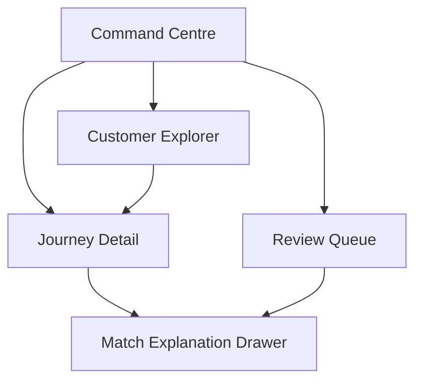
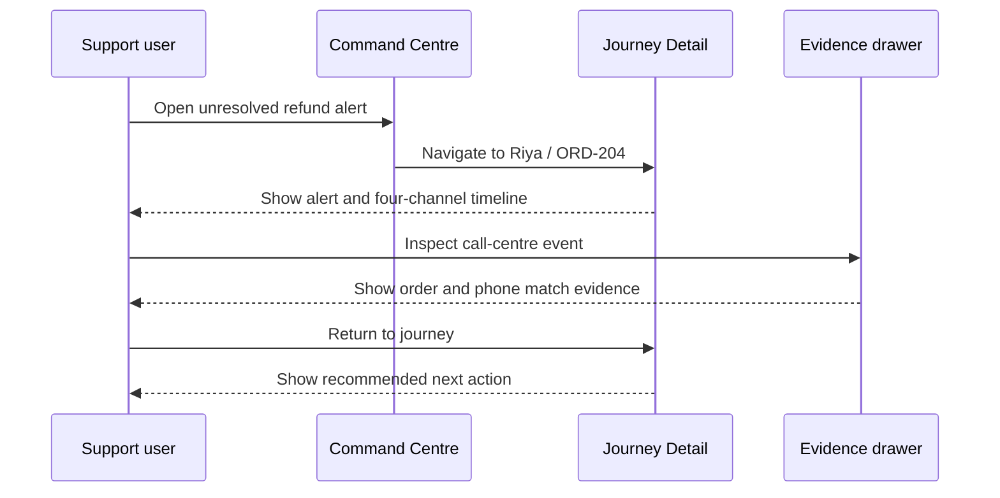

# JourneyLens User Workflows and UX Specification

**Version:** 1.0  
**Goal:** Define how the product behaves from the user's perspective before visual styling begins.

## 1. Experience principles

1. **Lead with the broken journey.** The user should see the active problem before aggregate charts.
2. **Evidence is one click away.** Every timeline link and review suggestion must be inspectable.
3. **Uncertainty is visible.** Use clear language such as “Needs review,” not false precision.
4. **Actions match authority.** JourneyLens recommends; the support user decides and acts outside the MVP.
5. **Status is never colour-only.** Pair colour with icons, labels, and text.
6. **The demo path is obvious.** One primary button starts or resets the flagship scenario.

## 2. Information architecture

### Navigation

- Command Centre
- Customers
- Reviews
- Demo control

Avoid separate pages for raw events, analytics, settings, or AI summaries in the MVP. They can be panels within the four core pages.

## 3. Golden-path workflow

### User objective

Understand why Riya contacted the company repeatedly and what unresolved issue requires attention.

### Acceptance conditions

- Alert title names `ORD-204` and its severity.
- Timeline shows channel, event type, timestamp, and short description.
- Each linked event shows a decision label and confidence.
- Evidence drawer shows raw payload, normalized fields, candidates, evidence, conflicts, and outcome.
- Recommended action is operational and non-autonomous: “Prioritize refund resolution.”

## 4. Workflow: run the controlled demo

### Trigger

Presenter selects `Run refund journey demo`.

### Steps

1. Present a confirmation only if reset will clear existing demo data.
2. Reset the demo namespace or seeded tables.
3. Disable the start button and show progress.
4. Insert events in a fixed order every one to two seconds.
5. Update recent-event feed and counters through polling.
6. After the mobile event, show that the earlier anonymous web record is linked.
7. After the later support/store events, create alerts.
8. End with a visible link to Riya's Journey Detail page.

### Event sequence

| Step | Event | UI moment |
|---:|---|---|
| 1 | Web `return_started`, `DEV-17` | Anonymous event appears |
| 2 | App `refund_status_checked`, email + `DEV-17` + `ORD-204` | Identity link appears with evidence |
| 3 | Call-centre `support_call`, phone + `ORD-204` | Timeline gains a support contact |
| 4 | Store `return_requested`, phone + `ORD-204` | Fourth channel appears |
| 5 | Second contact/no completion | Unresolved-refund and repeat-contact alerts appear |
| 6 | Ambiguous Aarav record | Review count increases |

### Error and fallback behavior

- If a step fails, stop playback and show the failing step and error message.
- Provide `Retry step` and `Reset demo` controls.
- Keep a `Load completed scenario` action that seeds the final state instantly.

## 5. Workflow: review an ambiguous match

### Entry state

The event contains a similar name and perhaps the same city, but no shared strong identifier.

### Reviewer flow

1. Open pending case.
2. Read incoming event fields.
3. Compare with the highest-ranked existing profile.
4. Read the reason: “Name similarity and city match; no shared email, phone, order, customer ID, or device.”
5. Choose an action.
6. Confirm only for an actual merge; keeping separate should remain fast.
7. Save reviewer name/note and show a success state.

### Actions

| Action | Result |
|---|---|
| Approve match | Event links to selected profile; journey rules rerun |
| Reject match | Candidate is rejected; event remains unresolved or another candidate is considered |
| Create new profile | Event receives a new, separate profile |

### Demo copy

> Decision saved: a separate customer profile was created. Similar names were not treated as sufficient identity evidence.

## 6. Screen specification

### Screen 1 — Command Centre

#### Purpose

Show current operational state and provide entry points into the golden path.

#### Layout priority

1. Active high-severity journey alerts.
2. Run/reset demo control.
3. Core KPIs.
4. Recent processing activity.
5. Small, useful charts.

#### KPI cards

- Events processed
- Unified profiles
- Open broken journeys
- Pending reviews
- Match precision/F1

Do not show a metric if it is not calculated by the API.

#### Recent event row

- timestamp;
- channel icon and label;
- event type;
- identity outcome;
- score when applicable;
- link to profile or review.

#### States

| State | Required behavior |
|---|---|
| Empty | Explain how to load or run the demo |
| Loading | Use stable skeletons, not jumping layout |
| Partial failure | Show available metrics and identify unavailable component |
| Active playback | Show current step and disable duplicate starts |
| Complete | Offer `View Riya's journey` and `Reset` |

### Screen 2 — Customer Explorer

#### Table columns

- Customer
- Verified identifiers
- Channels used
- Event count
- Active issue
- Last seen
- Action

#### Search and filters

- Free text: name, email, phone, order ID
- Has open alert
- Needs review
- Channel

#### Same-name handling

If two profiles have the same display name, show stable differentiators such as masked email, city, or profile suffix. Never label one as a duplicate without evidence.

### Screen 3 — Journey Detail

#### Header

- Display name and profile ID
- Email and phone if known
- Channel count
- Last activity
- Active alert severity

#### Alert panel

- `Refund ORD-204 remains unresolved`
- Evidence summary: return present, no refund completion, contact count, elapsed time
- Recommended action: `Prioritize refund resolution and review the latest contact`

#### Timeline card

- channel and event type;
- occurred time;
- human-readable description;
- order/issue reference;
- decision badge;
- score;
- evidence shortcut.

#### Evidence drawer tabs

1. Explanation
2. Normalized fields
3. Raw payload

The first tab should show the decision before implementation details.

### Screen 4 — Review Queue

#### List view

- event identity summary;
- channel and timestamp;
- best candidate;
- score;
- primary reason;
- age of review.

#### Detail view

- side-by-side event and candidate identifiers;
- matches highlighted;
- conflicts highlighted;
- missing fields shown explicitly;
- alternative candidates;
- available actions;
- reviewer note.

## 7. Status language

| Internal value | User-facing label | Explanation |
|---|---|---|
| `auto_linked` | Linked automatically | Strong evidence agrees and no conflict exists |
| `manual_review` | Needs review | Evidence is incomplete or conflicting |
| `new_profile` | New profile created | No credible existing match was found |
| `rejected` | Match rejected | A reviewer rejected the proposed candidate |
| `failed` | Processing failed | Raw event was saved but processing needs attention |
| `duplicate` | Duplicate ignored | This source record was already processed |

## 8. UX acceptance checklist

- [ ] Golden path takes no more than five primary user actions.
- [ ] Evidence is available from every linked event.
- [ ] Raw JSON is readable and copyable.
- [ ] Review actions are clear and mutually exclusive.
- [ ] A merge action requires confirmation.
- [ ] Empty, loading, error, and success states exist.
- [ ] Same-name profiles remain visually distinct.
- [ ] All status colours have text labels.
- [ ] Demo can reset without a page refresh.
- [ ] No unfinished P2 control appears in the primary navigation.
