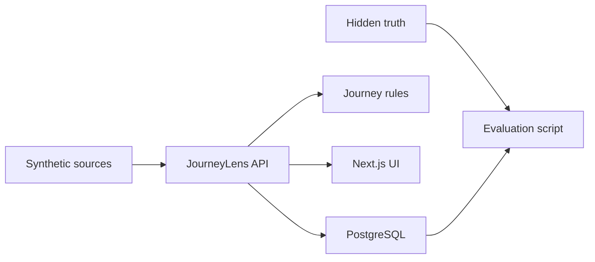
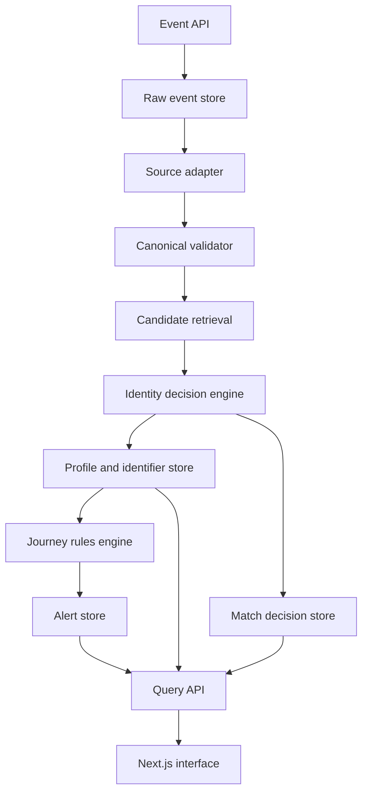
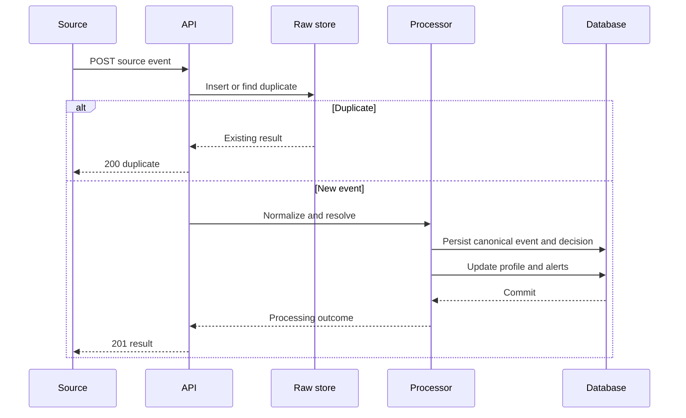
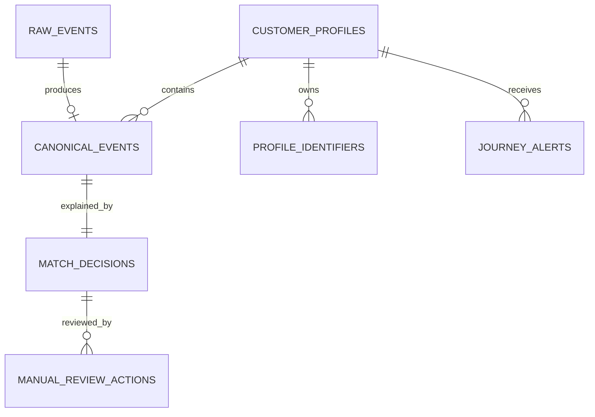

# JourneyLens Technical Architecture

**Version:** 1.0  
**Architecture goal:** Keep the system inspectable, testable, and small enough for a reliable hackathon implementation.

## 1. System context

JourneyLens receives synthetic events that imitate four disconnected commerce and support systems. It owns normalization, identity resolution, journey construction, alert detection, evaluation, and the demonstration interface.



## 2. Component architecture



## 3. Architectural decisions

| Decision | Choice | Reason |
|---|---|---|
| Application shape | Modular monolith | Fast integration without distributed-system overhead |
| Backend | FastAPI | Typed request validation and generated OpenAPI docs |
| Database | PostgreSQL via Supabase | Relational consistency plus JSONB for raw source variation |
| ORM | SQLAlchemy | Explicit transactions and portable data access |
| Frontend | Next.js with TypeScript | Fast dashboard development and typed client models |
| Processing | Synchronous request pipeline | Dataset and load are small; easier demo reasoning |
| Live display | Polling | More reliable than SSE for the baseline |
| Matching | Deterministic service | Explainable and measurable core decisions |
| AI | Optional adapter | Never required for matching, alerts, or demo success |

## 4. Processing lifecycle

### Transaction boundaries

The pipeline should use two safe boundaries:

1. **Raw acceptance transaction** — save the source record and duplicate key.
2. **Processing transaction** — create canonical event, identity decision, profile link, identifiers, and alerts.

If processing fails after raw acceptance, retain the raw event with `failed` status and a machine-readable error.

### Lifecycle sequence



## 5. Backend modules

| Module | Responsibility | Must not do |
|---|---|---|
| `api/events.py` | Request parsing and response mapping | Implement matching rules |
| `services/normalizer.py` | Source-to-canonical conversion | Write UI-specific labels |
| `services/candidate_retriever.py` | Find possible profiles | Decide the winner |
| `services/identity_resolver.py` | Score evidence and decide outcome | Generate prose with an LLM |
| `services/profile_service.py` | Create/link profiles and identifiers | Recompute scores |
| `services/journey_analyzer.py` | Evaluate deterministic journey rules | Merge identities |
| `services/review_service.py` | Apply human review actions | Bypass audit records |
| `services/evaluation.py` | Compare output to truth | Read truth during normal matching |
| `services/demo.py` | Reset and play controlled fixtures | Depend on external integrations |

## 6. Data architecture

### Layers

| Layer | Tables/data | Purpose |
|---|---|---|
| Bronze | `raw_events` | Immutable incoming evidence |
| Silver | `canonical_events`, `customer_profiles`, `profile_identifiers`, `match_decisions` | Standardized and resolved operational state |
| Gold | `journey_alerts`, computed overview metrics | User-facing insight |
| Evaluation | Files under `data/truth/` | Hidden expected identities and alerts |

### Core relationships



### Integrity rules

- Unique `(source, source_record_id)` for raw idempotency.
- Raw payload and received time never change.
- A canonical event references exactly one raw event.
- A canonical event may have no profile while awaiting review.
- Normalized identifier values use a uniqueness strategy appropriate to type and controlled dataset.
- Review actions are append-only.
- Open alerts are unique by profile, order, type, and open status.

## 7. Frontend architecture

### Data flow

- Keep server/API types in `frontend/lib/types.ts`.
- Centralize requests in `frontend/lib/api.ts`.
- Use route-level loading and error states.
- Poll only active dashboard/demo views.
- Stop polling when the tab is inactive if simple to implement.
- Use mock JSON matching the API contract until backend endpoints exist.

### Suggested component boundaries

```text
components/
  dashboard/
    KpiCard.tsx
    AlertList.tsx
    RecentEventFeed.tsx
    DemoController.tsx
  journey/
    ProfileHeader.tsx
    ActiveAlert.tsx
    JourneyTimeline.tsx
    TimelineEventCard.tsx
    MatchExplanationDrawer.tsx
  review/
    ReviewList.tsx
    CandidateComparison.tsx
    ReviewActions.tsx
  common/
    StatusBadge.tsx
    EmptyState.tsx
    ErrorPanel.tsx
```

## 8. Error model

All API errors should use one structure:

```json
{
  "error": {
    "code": "NORMALIZATION_FAILED",
    "message": "Phone value could not be normalized.",
    "stage": "normalization",
    "raw_event_id": "uuid-or-null",
    "details": {}
  }
}
```

### Error classes

| Class | Example | Expected handling |
|---|---|---|
| Validation | Missing source or record ID | Return 422; do not accept incomplete envelope |
| Normalization | Invalid timestamp/unsupported payload | Preserve raw record; mark failed; return 202 |
| Conflict | Email points to A and phone to B | Create review decision; do not treat as system error |
| Duplicate | Same source record received again | Return existing result with 200 |
| Dependency | Database unavailable | Return 503/500 and log stage |

## 9. Security and privacy baseline

The MVP uses synthetic data, but still follows clean engineering practices:

- credentials only in environment variables;
- `.env` excluded from version control;
- parameterized database access through ORM;
- request-size limits for payloads;
- no HTML rendering from source notes;
- optional masking of email/phone on list screens;
- reviewer actions store a display name, not authentication credentials;
- CORS restricted to the frontend origin when deployed.

## 10. Observability

Use structured application logs with:

- request/correlation ID;
- raw event ID;
- canonical event ID when available;
- processing stage;
- duration;
- outcome;
- error code.

Do not log secrets. With synthetic data, full payloads may be inspectable in the UI, but backend logging should still avoid unnecessary duplication.

## 11. Deployment topology

### Baseline

- Frontend: local Next.js server.
- Backend: local FastAPI server.
- Database: Supabase PostgreSQL.
- Fixtures: local repository files.

### Optional hosted demo

- Frontend: Vercel.
- Backend: Render or Railway.
- Database: Supabase.

Deployment is allowed only after the local deterministic demo passes three consecutive runs.

## 12. Scalability boundary

The design is intentionally adequate for hundreds of demo events, not an enterprise load. Index email, phone, order, customer ID, device ID, profile ID, event time, and open-alert fields. Do not add queues, caches, streaming platforms, or distributed workers unless the small synchronous pipeline is proven insufficient.

## 13. Architecture definition of done

- [ ] One event is traceable from raw payload to canonical event to decision to timeline.
- [ ] Duplicate ingestion is idempotent.
- [ ] Processing failure preserves the raw record.
- [ ] Strong-identifier conflict cannot auto-link.
- [ ] Review action is auditable.
- [ ] Alert duplication is prevented.
- [ ] Frontend and backend share matching types.
- [ ] Hidden truth is isolated from runtime matching.
- [ ] Core demo has no LLM or internet dependency.
