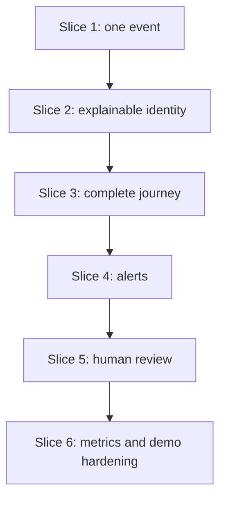

# JourneyLens Implementation and Team Plan

**Version:** 1.0  
**Team:** Three members  
**Timebox:** 30 hours

## 1. Delivery strategy

The project will be delivered as a sequence of complete vertical slices. Each slice must include data, backend, and frontend proof before the team expands scope.



## 2. Repository structure

```text
journeylens/
  frontend/
    app/
      page.tsx
      customers/page.tsx
      customers/[profileId]/page.tsx
      reviews/page.tsx
    components/
      dashboard/
      journey/
      review/
      common/
    lib/
      api.ts
      types.ts
      mock-data.ts
  backend/
    app/
      main.py
      api/
        events.py
        profiles.py
        reviews.py
        analytics.py
        demo.py
      models/
      schemas/
      services/
        normalizer.py
        candidate_retriever.py
        identity_resolver.py
        profile_service.py
        journey_analyzer.py
        review_service.py
        evaluation.py
        demo.py
      db/
        session.py
        migrations/
    scripts/
      generate_synthetic_data.py
      load_demo_data.py
      evaluate_matching.py
    tests/
      fixtures/
      test_normalization.py
      test_identity_resolution.py
      test_journey_rules.py
      test_api.py
  data/
    raw/
    truth/
  docs/
  docker-compose.yml
  .env.example
  README.md
```

## 3. Ownership

| Workstream | Primary owner | Secondary reviewer |
|---|---|---|
| Frontend UX and demo interaction | Member 1 | Member 2 |
| Backend API, database, processing orchestration | Member 2 | Member 3 |
| Dataset, resolver, journey rules, evaluation | Member 3 | Member 2 |
| Contract decisions | All | All |
| Demo narration and rehearsal | Member 1 | All |
| Scope control | One nominated lead | All |

Ownership does not prevent collaboration, but one person must be accountable for each deliverable.

## 4. Dependency map

| Deliverable | Depends on | Unlocks |
|---|---|---|
| Canonical schema | Product scope | Normalizers, models, frontend types |
| API examples | Canonical schema | Frontend mocks and integration tests |
| Migrations | Data entities | Processing persistence |
| Riya fixtures | Source mappings | Golden-path integration |
| Identity resolver | Normalization + candidates | Timeline linking and review queue |
| Journey rules | Linked events | Alerts and Command Centre |
| Evaluation | Resolver outputs + truth | Credible metrics |
| Demo playback | Stable ingestion + fixtures | Live narrative |

## 5. Detailed 30-hour plan

### Hours 0–2 — Foundation and contract freeze

**All members**

- Review `00_START_HERE.md` and PRD.
- Agree on enums, canonical event fields, thresholds, and P0 list.
- Create repository and base folders.
- Add sample environment file.
- Add one request/response fixture per API group.

**Member 1**

- Create Next.js shell and navigation.
- Add typed mock response for Journey Detail.

**Member 2**

- Create FastAPI shell, health endpoint, database session, and initial migration.

**Member 3**

- Create fixture directory, Riya/Aarav records, and test skeletons.

**Exit:** frontend, backend, and tests run; shared types are frozen.

### Hours 2–6 — Ingestion vertical slice

**Member 1**

- Build Journey Detail shell.
- Render one mock timeline card and explanation drawer.

**Member 2**

- Implement `raw_events` and `canonical_events`.
- Implement `POST /api/events` envelope validation and raw persistence.
- Add duplicate behavior.
- Wire one source adapter.

**Member 3**

- Implement normalization helpers and adapter tests.
- Complete four Riya source fixtures and two Aarav fixtures.

**Integration at hour 4:** Replace one frontend mock with the live web event response.

**Exit:** one web event travels from request to visible timeline.

### Hours 6–10 — Identity-resolution spike

**Member 1**

- Complete explanation drawer tabs.
- Add status/score badges and candidate display.

**Member 2**

- Add profile, identifier, and match-decision persistence.
- Expose profile detail and explanation endpoints.

**Member 3**

- Implement candidate retrieval, evidence scoring, thresholds, tie policy, and conflict rules.
- Write correct-merge and correct-non-merge tests.

**Integration at hour 8:** Run web → app linkage with `DEV-17`.

**Pivot review at hour 9–10:** If correct merge/non-merge cannot be made stable, switch to Refund Friction Radar.

**Exit:** every event creates a link, review, or new profile with evidence.

### Hours 10–14 — Journey and alerts

**Member 1**

- Finish unified timeline and prominent alert panel.

**Member 2**

- Complete profiles, timeline, analytics skeleton, and polling updates.

**Member 3**

- Implement unresolved-refund and repeat-contact rules.
- Add alert idempotency and expected-alert fixtures.
- Begin evaluation script.

**Integration:** Run all four Riya channel events.

**Exit:** `ORD-204` produces the complete journey and exactly two expected alerts.

### Hours 14–20 — Product surface

**Member 1**

- Build Command Centre and Customer Explorer.
- Add search/filter behavior, empty/loading/error states.

**Member 2**

- Complete query APIs and consistent error response.
- Expose real computed overview metrics.

**Member 3**

- Expand generator to target volume and edge cases.
- Run matcher evaluation and tune thresholds conservatively.

**Exit:** alert → customer → journey → evidence flow works with full synthetic data.

### Hours 20–24 — Human review and controlled playback

**Member 1**

- Build review list, candidate comparison, and action states.
- Build demo progress control.

**Member 2**

- Implement review resolution transaction and audit action.
- Implement demo reset/start/status and polling data.

**Member 3**

- Validate that review resolution updates identifiers and reruns journey rules.
- Add ambiguous and strong-conflict fixtures.

**Exit:** presenter keeps Aarav separate and can reset/replay the scenario.

### Hours 24–27 — Quality and evidence

- Run unit, integration, and end-to-end tests.
- Compute final metrics from hidden truth.
- Verify invalid and duplicate records.
- Test three consecutive demo resets.
- Fix only P0/P1 bugs.
- Improve accessibility, loading, and failure messages.
- Remove incomplete P2 controls.

**Exit:** release checklist passes.

### Hours 27–30 — Presentation and contingency

- Lock the code except for critical fixes.
- Rehearse the two-minute script repeatedly.
- Record a backup demo.
- Capture key screenshots.
- Prepare one architecture slide and one metrics slide.
- Confirm laptop, browser, local services, and seeded data.

**Exit:** live and fallback presentations are both ready.

## 6. Work board

Use five columns:

```text
Backlog → Ready → In progress → Review/Integration → Done
```

### Task rules

- A task should take no more than two hours.
- Each task has one owner and a named reviewer.
- `Done` means merged, tested, and demonstrable.
- Blocked tasks identify the exact dependency.
- P2 work cannot enter `In progress` while P0 work remains blocked.

## 7. Git workflow

For a three-person hackathon, keep branching simple:

- `main` must remain runnable.
- Use short feature branches: `frontend/journey-detail`, `backend/event-api`, `data/identity-tests`.
- Rebase or merge main before integration; avoid long-lived branches.
- Use small commits with one intent.
- Require one quick review for contract, migration, and identity-rule changes.
- Tag a known-good checkpoint before major demo changes.

### Commit examples

```text
feat(api): persist raw and canonical events
feat(identity): add strong conflict detection
test(journey): cover unresolved refund rule
fix(ui): keep same-name profiles visually distinct
docs(contract): freeze review resolution payload
```

## 8. Integration contract

Before a handoff, the owner provides:

- endpoint or function name;
- input example;
- output example;
- error behavior;
- test command;
- known limitation.

The receiving member first integrates the happy path, then error and empty states.

## 9. Decision log

Record changes in this format:

| Field | Example |
|---|---|
| Date/time | Hour 8 |
| Decision | Polling remains baseline; SSE deferred |
| Reason | Stable and adequate for six demo steps |
| Alternatives | SSE |
| Impact | No streaming connection code |
| Owner | Team lead |

### Locked decisions

- Explainable deterministic matching is the central mechanism.
- Name similarity alone never auto-links.
- Polling is the live-update baseline.
- Supabase PostgreSQL is the database.
- AI summaries are post-MVP unless all release criteria pass.
- Riya/`ORD-204` is the only flagship journey.
- Aarav is the mandatory non-merge safety story.

## 10. Backlog after the MVP

### Near-term

- Channel-switching alert
- Better alert prioritization
- CSV import
- More review-candidate comparisons
- Hosted deployment

### Future, not hackathon

- Real source connectors
- Authentication and roles
- Privacy/consent workflows
- Profile split/unmerge support
- Feedback-driven threshold calibration
- Production event queue and monitoring
- Multi-tenant architecture

## 11. Team definition of done

A task is done when:

- code is merged to a runnable branch;
- its acceptance criterion passes;
- errors are handled;
- relevant tests exist;
- types/contracts are updated;
- the owner can demonstrate it in under one minute; and
- it does not break the golden path.
